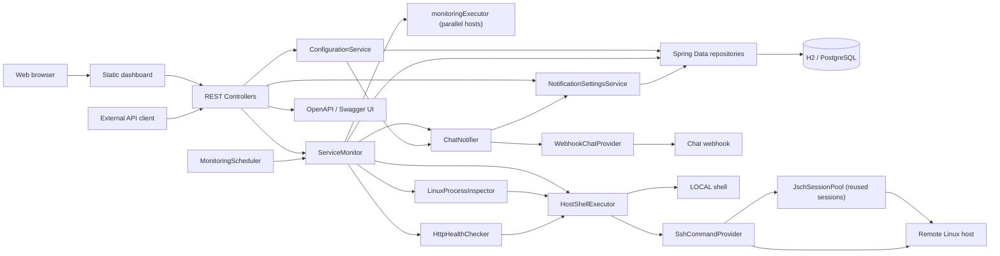
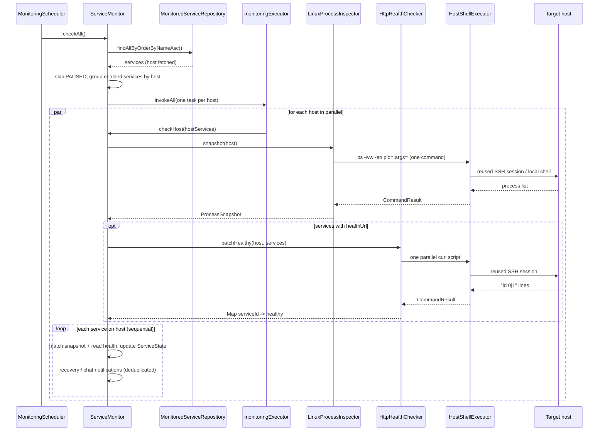
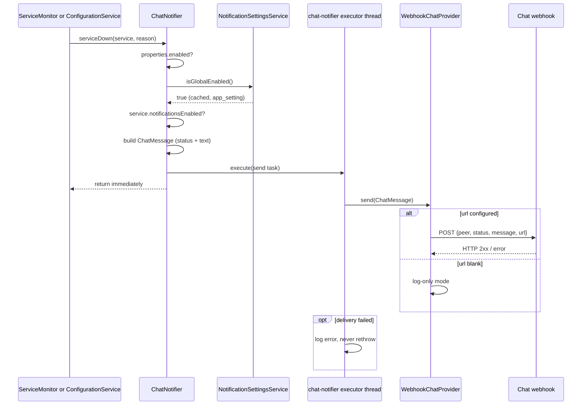
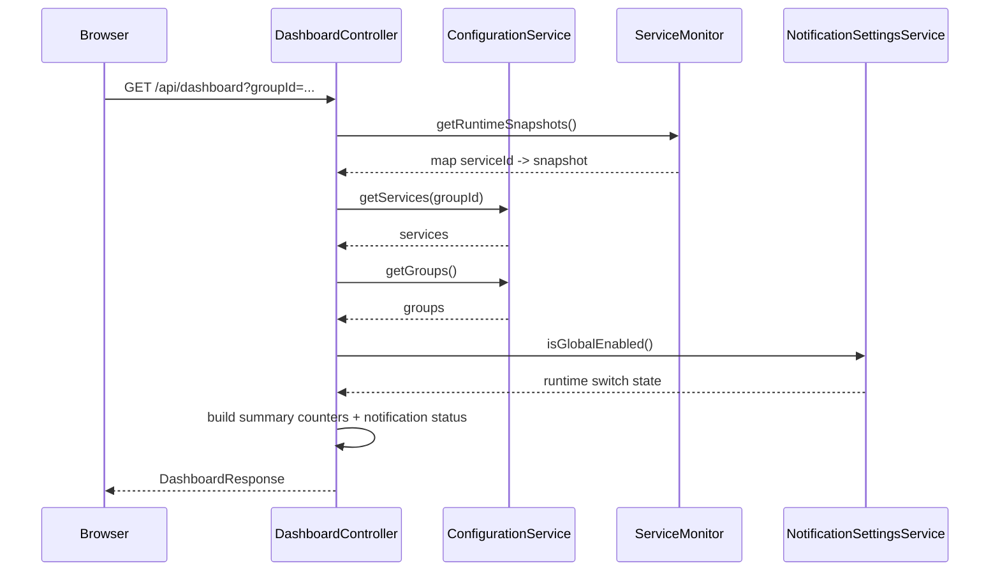
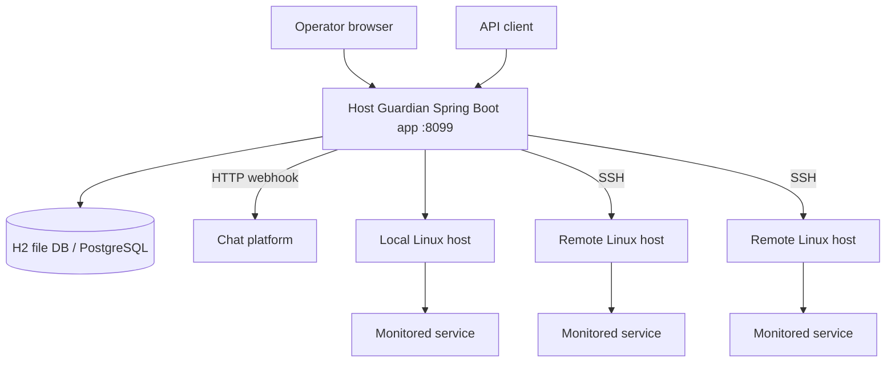

# Описание архитектуры решения Host Guardian

## 0. Информационная карточка

| Поле | Значение |
|---|---|
| Название сервиса | Host Guardian |
| Репозиторий | `hi-lt-watcher` |
| Тип решения | Операционная консоль мониторинга и восстановления сервисов на Linux-хостах |
| Технологический стек | Java 17, Spring Boot 3.2.5, Spring Web MVC, Spring Data JPA, Flyway, H2/PostgreSQL, HTML/CSS/JavaScript |
| Основной пользователь | Оператор, разработчик или администратор, отвечающий за состояние внутренних сервисов |
| Ключевая ценность | Единая панель для проверки, запуска и перезапуска сервисов, которые работают вне полноценного supervisor-окружения |

## 1. Введение и цели

Host Guardian представляет собой Spring Boot приложение для мониторинга и восстановления внутренних сервисов, запущенных на одном или нескольких Linux-хостах. Решение ориентировано на ситуации, когда приложения работают как `java -jar`, shell-скрипты или фоновые процессы и еще не переведены под `systemd`, Kubernetes или другой зрелый механизм управления жизненным циклом.

Сервис хранит конфигурацию мониторинга в базе данных, выполняет регулярные проверки процессов, опционально проверяет HTTP health endpoint, поддерживает ручные действия оператора и предоставляет встроенный веб-dashboard. Выполнение команд возможно на локальном хосте или удаленно по SSH. О ключевых событиях мониторинга (падение и восстановление сервиса, попытки и ошибки перезапуска, исчерпание лимита рестартов, изменения состава сервисов) система отправляет оповещения в корпоративный чат через настраиваемый HTTP webhook.

### Бизнес-цели

| Цель | Описание |
|---|---|
| Сокращение времени реакции на сбои | Оператор видит текущее состояние сервисов в единой панели и может запустить проверку или recovery-действие без ручного входа на сервер. |
| Раннее информирование об инцидентах | Оповещения в чат о падениях, попытках восстановления и исчерпании лимита рестартов доводят проблему до команды без постоянного наблюдения за dashboard. |
| Повышение доступности внутренних сервисов | Автоматический start recovery поднимает отсутствующие процессы в рамках заданных ограничений. |
| Централизация операционной конфигурации | Хосты, группы и мониторируемые сервисы хранятся в БД и управляются через REST API/dashboard. |
| Снижение риска ручных ошибок | Команды старта и рестарта фиксируются в конфигурации, а частота recovery-действий ограничивается cooldown/window политиками. |
| Подготовка к дальнейшему развитию | Архитектура допускает подключение PostgreSQL, удаленных SSH-хостов, дополнительных каналов уведомлений (через реализации `ChatProvider` поверх существующего webhook-канала), аудита и RBAC. |

### Обзор требований

| Сценарий | Краткое описание |
|---|---|
| Регистрация хостов | Пользователь создает локальные или SSH-хосты, на которых будут выполняться проверки и команды. |
| Регистрация групп сервисов | Пользователь создает логические группы для фильтрации и организации dashboard. |
| Регистрация мониторируемого сервиса | Пользователь задает имя, хост, группу, шаблон поиска процесса, команды, health URL и restart-политику. |
| Периодический мониторинг | Система по расписанию проверяет все включенные сервисы. |
| Проверка процесса | Система один раз снимает список процессов хоста (`ps -ww -eo pid=,args=`), локально матчит каждый сервис и сохраняет PID. |
| HTTP health-check | Если задан `healthUrl`, система проверяет прикладную готовность сервиса через HTTP. |
| Автоматический start recovery | Если процесс отсутствует и policy разрешает действие, система выполняет только `startCommand`. |
| Ручная проверка | Оператор запускает немедленную проверку одного сервиса. |
| Ручной restart | Оператор запускает контролируемый recovery-flow: старт отсутствующего процесса или рестарт при упавшем health-check. |
| Оповещения в чат | Система отправляет сообщения о событиях мониторинга и изменениях конфигурации через HTTP webhook с дедупликацией повторных алертов. |
| Управление оповещениями | Оператор отключает оповещения на трех уровнях: главный выключатель в конфигурации, глобальный runtime-переключатель и переключатель по каждому сервису на dashboard. |
| Dashboard | Пользователь просматривает сводку, статусы, PID, состояние health-check, последние сообщения и управляет конфигурацией. |

### Цели по качеству решения

| Название цели | Краткое описание |
|---|---|
| Надежность | Ошибка проверки одного сервиса не должна останавливать мониторинг остальных сервисов. |
| Доступность | Dashboard и API должны оставаться доступными для операционных действий, пока работает приложение Host Guardian. |
| Безопасность | Доступ к удаленным хостам должен быть контролируемым; чувствительные SSH-данные не должны попадать в логи. |
| Поддерживаемость | Код должен быть разделен на понятные слои: REST, конфигурационная логика, мониторинг, выполнение команд, persistence. |
| Расширяемость | Должна сохраняться возможность добавить уведомления, audit trail, RBAC, новые SSH/command providers и историю проверок без полной переработки. |
| Наблюдаемость | Логи и runtime-состояние должны позволять понять, почему сервис отмечен как `UP`, `DOWN`, `PAUSED`, `RESTARTING` или `ERROR`; ключевые события дублируются оповещениями в чат. |
| Невмешательство оповещений | Отправка оповещений не должна влиять на цикл мониторинга и REST-операции: ошибки чата логируются и не распространяются дальше. |
| Удобство эксплуатации | Dashboard должен закрывать базовые задачи оператора без прямого выполнения shell-команд вручную. |

### Ключевые участники

| Роль | Ожидания |
|---|---|
| Оператор/дежурный инженер | Быстро увидеть проблему, запустить проверку или восстановление, не ошибиться в командах. |
| Разработчик сервиса | Получить простой способ наблюдать состояние приложения вне Kubernetes/systemd. |
| Администратор инфраструктуры | Контролировать список хостов, SSH-доступы, команды и политики восстановления. |
| Владелец продукта/системы | Снизить простой внутренних сервисов и повысить прозрачность эксплуатации. |
| Специалист по безопасности | Минимизировать риски несанкционированного доступа к хостам и утечки секретов. |

## 2. Архитектурные ограничения

| Категория | Ограничение | Описание |
|---|---|---|
| Технические | Linux target hosts | Мониторинг процессов опирается на `bash`, `ps`, `curl` и shell-команды, поэтому целевые хосты предполагаются Linux-окружениями. |
| Технические | Java/Spring Boot | Основной backend реализован на Java 17 и Spring Boot 3.2.5. |
| Инфраструктурные | H2/PostgreSQL | Локально используется file-based H2, для более устойчивого окружения предусмотрен PostgreSQL profile. |
| Инфраструктурные | LOCAL/SSH execution | Команды выполняются либо локально на хосте Host Guardian, либо удаленно через SSH. |
| Безопасность | Key-based SSH | SSH-доступ сейчас моделируется через пользователя и путь к private key. Password/passphrase management не выделен отдельно. |
| Организационные | Встроенный UI | Dashboard поставляется как статические ресурсы внутри Spring Boot приложения, без отдельного frontend-сервиса. |
| Функциональные | Нет полноценного supervisor | Host Guardian не заменяет Kubernetes/systemd, а закрывает промежуточный сценарий host-based мониторинга и recovery. |
| Функциональные | Канал оповещений — HTTP webhook | Оповещения доставляются POST-запросом с JSON-payload (`peer`, `status`, `message`, `url`), совместимым со старым SberChat-отправителем. Гарантированная доставка (очередь, retry) не реализована: при недоступном чате сообщение логируется и теряется. |

## 3. Границы и окружение системы

### Бизнес-контекст

Host Guardian находится между операционной командой и набором контролируемых внутренних сервисов. Система не является бизнес-сервисом конечного пользователя; это внутренний инструмент эксплуатации, который помогает поддерживать работоспособность прикладных процессов.

Основные бизнес-взаимодействия:

- операторы управляют хостами, группами и мониторируемыми сервисами;
- dashboard показывает состояние сервисов и дает ручные действия;
- scheduler автоматически проверяет сервисы и при необходимости запускает start recovery;
- SSH/LOCAL execution слой выполняет команды на целевых хостах;
- ключевые события мониторинга и изменения состава сервисов отправляются оповещениями в корпоративный чат через HTTP webhook;
- БД хранит конфигурацию и runtime-переключатель оповещений, а runtime-состояние последних проверок живет в памяти приложения.

### Перечень партнеров

| Партнер | Описание взаимодействия |
|---|---|
| Оператор / разработчик | Использует dashboard или REST API для настройки хостов, групп, сервисов и запуска ручных операций. |
| Целевой Linux-хост | На нем выполняются команды поиска процесса, PID-check, health-check и start/restart. |
| Мониторируемый сервис | Процесс, состояние которого определяется по `processMatch`, PID и опциональному HTTP health endpoint. |
| SSH-провайдер | Выполняет команды на удаленном хосте через системный `ssh` client или JSch. |
| Чат-платформа | Принимает webhook-оповещения о событиях мониторинга; payload совместим со старым SberChat-эндпоинтом, поэтому существующий корпоративный канал подключается настройкой `url` и `peer`. |
| База данных | Хранит `host_config`, `service_group`, `monitored_service`, `app_setting` и мигрируется Flyway. |
| API-клиент | Может использовать REST API для интеграции с внешними консолями или скриптами. |
| Браузер пользователя | Загружает встроенный dashboard и обращается к REST API приложения. |

### Технический контекст

| Внешний контур | Интерфейс | Вход | Выход |
|---|---|---|---|
| Web dashboard | HTTP/REST | Действия пользователя, формы конфигурации, фильтры | Сводка статусов, списки хостов/групп/сервисов, результат действий |
| REST API | JSON over HTTP | CRUD-запросы, manual check/restart, фильтрация | DTO ответов, HTTP status, `ProblemDetail` при ошибках |
| Target host LOCAL | Shell command | `ps`-снимок процессов, `curl`, start/restart command | Exit code, stdout, stderr |
| Target host SSH | SSH command | Те же команды, но на удаленной машине | Exit code, stdout, stderr, ошибки подключения |
| H2/PostgreSQL | JDBC/JPA | Чтение и запись конфигурации | Persistent state конфигурации |
| Chat webhook | HTTP POST (JSON) | Событие мониторинга: `peer`, `status`, `message`, `url` | HTTP-ответ чат-платформы; ошибки доставки логируются и не влияют на мониторинг |
| OpenAPI/Swagger UI | HTTP | Запрос документации | OpenAPI JSON и интерактивный Swagger UI |

## 4. Стратегия решения

| Категория | Описание принятого решения | Рассмотренные альтернативы | Обоснование |
|---|---|---|---|
| Технологии | Java 17 + Spring Boot 3.2.5, Spring MVC, JPA, Flyway. | Go, Node.js, shell-only решение. | Spring Boot хорошо подходит для REST API, scheduler, валидации, JPA и быстрой поддержки небольшой командой. |
| Декомпозиция | Модульный монолит с разделением на controllers, services, repositories, model, api, scheduler. | Микросервисы, один большой controller/service. | Модульный монолит снижает операционную сложность, но сохраняет понятные границы для развития. |
| Хранение данных | Конфигурация хранится в БД, runtime snapshots хранятся в памяти. | Только YAML, хранить все runtime-состояние в БД. | БД удобна для dashboard/API и PostgreSQL profile; runtime в памяти дешевле и достаточен для текущего состояния. |
| Выполнение команд | Единый `HostShellExecutor` маршрутизирует выполнение в LOCAL или SSH. | Только локальные команды, прямые SSH-вызовы из мониторинга. | Отдельный слой изолирует детали выполнения и позволяет менять provider. |
| Recovery logic | Автоматически стартуется только отсутствующий процесс; полный restart выполняется вручную и только при проверенных условиях. | Автоматический полный restart при любом сбое. | Выбранный подход снижает риск restart storm и разрушительных действий при ложных health-check отказах. |
| UI | Встроенный статический dashboard. | Отдельное SPA-приложение. | Встроенный UI проще поставлять и сопровождать для операционного инструмента. |
| Оповещения | Асинхронные чат-оповещения через generic HTTP webhook (`ChatProvider` абстракция) с дедупликацией алертов и трехуровневым отключением. | Жестко зашитый SberChat-клиент; синхронная отправка из цикла мониторинга; оповещение на каждый цикл проверки. | Абстракция транспорта не привязывает ядро к конкретному чату; отдельный поток отправки защищает цикл мониторинга от медленного чата; флаги дедупликации дают одну пару сообщений «упал/восстановился» на эпизод вместо спама каждые 30 секунд. |

## 5. Компонентный состав

### Верхнеуровневая компонентная схема

### Основные части системы

| Компонент | Ответственность | Входящие коммуникации | Исходящие коммуникации |
|---|---|---|---|
| Web dashboard | Операционный UI для просмотра статусов и управления конфигурацией. | HTTP responses, статические ресурсы. | REST-запросы к API. |
| REST Controllers | HTTP-контур для dashboard и внешних клиентов. | REST-запросы по `/api/*`. | Вызовы `ConfigurationService`, `ServiceMonitor`, маппинг DTO. |
| ConfigurationService | Правила создания, обновления, удаления и чтения хостов, групп и сервисов. | REST controllers. | Spring Data repositories. |
| ServiceMonitor | Центральная логика проверки сервисов, вычисления статуса и запуска recovery. | Scheduler, REST manual actions. | Repositories, process inspector, health checker, shell executor. |
| MonitoringScheduler | Периодический запуск `ServiceMonitor.checkAll()` по `monitor.interval`. | Spring scheduling. | ServiceMonitor. |
| LinuxProcessInspector | Снимок процессов хоста (`ps -ww -eo`) и остановка процесса при restart-flow. | ServiceMonitor. | HostShellExecutor. |
| ProcessSnapshot | Иммутабельный снимок процессов хоста; локально матчит `processMatch` каждого сервиса (regex с fallback на подстроку). | ServiceMonitor. | — (in-memory). |
| HttpHealthChecker | Пакетная HTTP-проверка всех сервисов хоста: один параллельный `curl`-скрипт на удаленном хосте, RestTemplate — на локальном. | ServiceMonitor. | HostShellExecutor / `curl`. |
| HostShellExecutor | Единая точка выполнения команд на LOCAL или SSH-хосте. | Process inspector, health checker, monitor. | CommandExecutor, SshCommandProvider. |
| CommandExecutor | Низкоуровневое выполнение локальных shell-команд с timeout. | HostShellExecutor. | ОС хоста Host Guardian. |
| SshCommandProvider | Выполнение удаленных команд через `system` SSH или JSch. | HostShellExecutor. | Удаленный Linux-хост, JschSessionPool. |
| JschSessionPool | Кэш долгоживущих SSH-сессий по хосту с keepalive и реконнектом; убирает SSH-хендшейк на каждую команду. | JschSshCommandProvider. | JschFacade, удаленный хост. |
| monitoringExecutor | Пул потоков (`monitor.concurrency`) для параллельной проверки независимых хостов в одном цикле. | ServiceMonitor. | — (управление потоками). |
| ChatNotifier | Подготовка текстов оповещений, гейтинг по трем переключателям и безопасная асинхронная передача сообщений провайдеру; слушает `ApplicationReadyEvent` для стартового сообщения. | ServiceMonitor, ConfigurationService, Spring events. | NotificationSettingsService, ChatProvider, выделенный поток `chat-notifier`. |
| WebhookChatProvider | Реализация `ChatProvider`: POST JSON-payload на настроенный webhook с таймаутами и опциональным auth-заголовком; при пустом URL — log-only режим. | ChatNotifier (через интерфейс `ChatProvider`). | Чат-платформа по HTTP. |
| NotificationSettingsService | Хранение глобального runtime-переключателя оповещений в таблице `app_setting` с in-memory кэшем. | ChatNotifier, NotificationController, DashboardController. | AppSettingRepository. |
| NotificationController | REST-управление глобальным переключателем; отклоняет изменения (409), когда функционал отключен конфигурацией. | REST-запросы `/api/notifications`. | NotificationProperties, NotificationSettingsService. |
| Repositories/DB | Хранение persistent-конфигурации и настроек приложения. | Services. | H2/PostgreSQL. |
| OpenAPI config | Публикация описания API и Swagger UI. | HTTP-запросы к `/swagger-ui.html`, `/v3/api-docs`. | OpenAPI JSON/UI. |

### Основные REST API

| API | Описание | MVP |
|---|---|---|
| `GET /api/dashboard` | Сводка статусов, список групп и сервисов с runtime snapshots. | Да |
| `GET /api/hosts` | Получение списка хостов. | Да |
| `POST /api/hosts` | Создание хоста `LOCAL` или `SSH`. | Да |
| `PUT /api/hosts/{id}` | Обновление хоста. | Да |
| `DELETE /api/hosts/{id}` | Удаление хоста, если на него не ссылаются сервисы. | Да |
| `GET /api/groups` | Получение списка групп. | Да |
| `POST /api/groups` | Создание группы. | Да |
| `PUT /api/groups/{id}` | Обновление группы. | Да |
| `DELETE /api/groups/{id}` | Удаление группы, если она не используется сервисами. | Да |
| `GET /api/services` | Получение списка сервисов с фильтром по `groupId`. | Да |
| `GET /api/services/{id}` | Получение одного сервиса. | Да |
| `POST /api/services` | Создание мониторируемого сервиса. | Да |
| `PUT /api/services/{id}` | Обновление мониторируемого сервиса. | Да |
| `PATCH /api/services/{id}/monitoring` | Включение/отключение мониторинга. | Да |
| `PATCH /api/services/{id}/notifications` | Включение/отключение чат-оповещений конкретного сервиса. | Нет, добавлено после MVP |
| `POST /api/services/{id}/check` | Немедленная проверка сервиса. | Да |
| `POST /api/services/{id}/restart` | Контролируемый recovery-flow. | Да |
| `DELETE /api/services/{id}` | Удаление сервиса. | Да |
| `GET /api/notifications` | Состояние функционала оповещений: флаг конфигурации и runtime-переключатель. | Нет, добавлено после MVP |
| `PATCH /api/notifications` | Переключение глобального runtime-выключателя оповещений; 409, если функционал отключен в `application.yml`. | Нет, добавлено после MVP |

### Доменная модель и агрегаты

| Название | Описание |
|---|---|
| `HostConfig` | Целевой хост: имя, режим подключения, адрес, SSH port, SSH user, private key path, описание. |
| `ServiceGroup` | Логическая группа сервисов для фильтрации dashboard и API. |
| `MonitoredService` | Основной persistent-агрегат мониторинга: имя, хост, группа, process match, execution path, start/restart команды, health URL, restart policy, monitoring flag, notifications flag, last known PID. |
| `AppSetting` | Persistent key-value настройка приложения; хранит глобальный runtime-переключатель оповещений (`notifications.global-enabled`). |
| `ServiceState` | In-memory runtime state: статус, время последней проверки, время последнего restart/start, PID, состояние health-check, сообщение, история recovery-действий, флаги дедупликации алертов (down, start failure, restart limit). |
| `ServiceRuntimeSnapshot` | Immutable DTO runtime-состояния для API/dashboard. |
| `ServiceHealthStatus` | Статусы `UNKNOWN`, `UP`, `DOWN`, `PAUSED`, `RESTARTING`, `ERROR`. |
| `ChatMessage` | Immutable сообщение оповещения: серьезность и текст; передается реализации `ChatProvider`. |
| `MessageStatus` | Статусы, принимаемые чат-провайдером: `OK`, `FAIL`, `SUCCESS`, `FAILURE`, `UNSTABLE`, `NOT_BUILT`, `ABORTED`; строковое значение (`getValue()`) передается в поле `status` payload. |

## 6. Динамическое представление

### Перечень сценариев

| Сценарий | Описание | Список компонентов |
|---|---|---|
| Периодический мониторинг | Scheduler запускает цикл; отключенные сервисы помечаются `PAUSED`, остальные группируются по хосту; хосты проверяются параллельно, на каждый хост — один снимок процессов и один пакетный health-check. | `MonitoringScheduler`, `ServiceMonitor`, `monitoringExecutor`, repositories, `LinuxProcessInspector`, `ProcessSnapshot`, `HttpHealthChecker`, `HostShellExecutor`. |
| Автоматический start recovery | Если процесс отсутствует, а cooldown/window policy разрешает действие, выполняется `startCommand`. | `ServiceMonitor`, `HostShellExecutor`, `CommandExecutor` или `SshCommandProvider`, target host. |
| Ручная проверка | Оператор нажимает check; система сразу проверяет один сервис и обновляет runtime state. | Dashboard, `MonitoredServiceController`, `ServiceMonitor`. |
| Ручной restart | Оператор нажимает restart; если процесс отсутствует, выполняется start; если health-check отсутствует или успешен, restart не выполняется; если health-check падает, выполняется restart/stop + start. | Dashboard, `MonitoredServiceController`, `ServiceMonitor`, `LinuxProcessInspector`, `HostShellExecutor`. |
| Управление конфигурацией | Пользователь создает/редактирует/удаляет хосты, группы и сервисы; изменения сохраняются в БД; добавление и удаление сервиса дополнительно оповещается в чат. | Dashboard/API client, REST controllers, `ConfigurationService`, repositories, DB, `ChatNotifier`. |
| Оповещение о событии мониторинга | При падении, попытке восстановления, ошибке команды, исчерпании лимита рестартов или восстановлении сервиса монитор формирует сообщение; нотификатор проверяет три переключателя, дедуплицирует алерты и асинхронно отправляет сообщение в чат. | `ServiceMonitor`, `ChatNotifier`, `NotificationSettingsService`, `WebhookChatProvider`, chat webhook. |
| Управление оповещениями | Оператор переключает глобальный выключатель или флаг конкретного сервиса; при отключенном в конфигурации функционале UI скрывает элементы управления, а API глобального переключателя отвечает 409. | Dashboard, `NotificationController`, `MonitoredServiceController`, `ConfigurationService`, `NotificationSettingsService`. |
| Просмотр dashboard | UI запрашивает `/api/dashboard`, получает конфигурацию, runtime snapshots и состояние функционала оповещений в одном агрегированном ответе. | Browser, static UI, `DashboardController`, `ConfigurationService`, `ServiceMonitor`, `NotificationSettingsService`. |

### Сиквенс: периодическая проверка сервиса

### Сиквенс: доставка оповещения в чат

### Сиквенс: загрузка dashboard

UI использует блок `notifications` ответа dashboard, чтобы показать или скрыть элементы управления оповещениями: при `featureEnabled=false` скрываются глобальный переключатель, пункт меню сервиса и чекбокс формы.

## 7. Схема развертывания

| Особенность | Описание |
|---|---|
| Тип поставки | Spring Boot jar или запуск через Maven в dev-окружении. |
| Контейнеризация | Возможна через Docker, но в репозитории явно задан только `docker-compose.postgres.yml` для локального PostgreSQL. |
| Контуры | Dev/local: H2 file DB. Test/prod-like: PostgreSQL profile. |
| Внешний доступ | HTTP на порту `8099`; dashboard по `/`, Swagger UI по `/swagger-ui.html`, API по `/api/*`. |
| База данных | H2 по умолчанию: `jdbc:h2:file:./data/host-guardian`; PostgreSQL через `SPRING_PROFILES_ACTIVE=postgres`. |
| SSH | Для удаленного выполнения требуется доступ с хоста Host Guardian к target host по private key. |
| Чат-интеграция | Исходящий HTTP POST на `notification.chat.url` (webhook чат-платформы); при пустом URL сообщения пишутся только в лог приложения. |
| Миграции | Flyway запускает миграции при старте приложения (включая `V3__notifications.sql`: колонка `notifications_enabled`, таблица `app_setting`). |
| Конфигурация | `application.yml`, `application-postgres.yml`, переменные окружения PostgreSQL, `monitor.*` и `notification.chat.*` настройки. |

## 8. Архитектурные и дизайн-решения (ADR)

| ADR | Аргументация |
|---|---|
| ADR-001. Модульный монолит на Spring Boot | Контекст: сервис небольшой, но включает API, UI, scheduler, БД и выполнение команд. Альтернативы: микросервисы или shell-only утилита. Решение: один Spring Boot сервис с четкими пакетными границами. Почему так: проще разворачивать, тестировать и сопровождать; при росте можно выделить компоненты по уже существующим границам. |
| ADR-002. Конфигурация в БД, runtime-состояние в памяти | Контекст: операторам нужна управляемая конфигурация через UI/API, но история всех проверок пока не является обязательной. Альтернативы: YAML-only или хранение каждого runtime события в БД. Решение: persistent-конфигурация в JPA entities, последние статусы в `ConcurrentHashMap`. Почему так: быстрый dashboard, простая модель и меньше записи в БД. Ограничение: runtime-состояние не переживает restart приложения. |
| ADR-003. LOCAL/SSH выполнение через отдельный executor | Контекст: сервисы могут жить на разных хостах. Альтернативы: только локальное выполнение или прямые SSH-вызовы из бизнес-логики. Решение: `HostShellExecutor` выбирает LOCAL или SSH, а SSH provider может быть `system` или JSch. Почему так: детали транспорта изолированы, можно менять provider без переписывания мониторинга. |
| ADR-004. Осторожная recovery-политика | Контекст: автоматический restart может усилить инцидент. Альтернативы: полный автоматический restart при любом DOWN. Решение: автоматический режим выполняет только start отсутствующего процесса; ручной restart проверяет состояние и не перезапускает healthy сервис. Почему так: меньше разрушительных действий и ниже риск restart storm. |
| ADR-005. Встроенный dashboard вместо отдельного frontend | Контекст: UI нужен для операционных задач, а не как публичный продукт. Альтернативы: SPA с отдельной сборкой и деплоем. Решение: статические HTML/CSS/JS ресурсы внутри Spring Boot. Почему так: проще поставка, меньше инфраструктуры, достаточно для MVP. |
| ADR-006. Оповещения через generic webhook с асинхронной отправкой и дедупликацией | Контекст: команде нужны оповещения о событиях мониторинга в корпоративном чате; в legacy-проекте существовал жестко зашитый SberChat-клиент, отправлявший сообщения синхронно и без защиты от повторов. Альтернативы: перенос SberChat-клиента как есть; синхронная отправка из цикла мониторинга; отдельный notification-сервис. Решение: интерфейс `ChatProvider` с реализацией `WebhookChatProvider` (JSON-payload `peer`/`status`/`message`/`url`, совместимый со старым эндпоинтом), отправка в выделенном однопоточном executor, флаги дедупликации в `ServiceState`, log-only режим при пустом URL. Почему так: транспорт заменяем без изменения ядра; существующий корпоративный эндпоинт подключается одной настройкой; ошибки и задержки чата не влияют на мониторинг; один эпизод сбоя дает одну пару сообщений «упал/восстановился»; однопоточный executor сохраняет порядок сообщений. |
| ADR-007. Трехуровневое отключение оповещений | Контекст: оповещения должны отключаться полностью (окружения без чата), временно (шумные работы) и точечно (отдельные сервисы). Альтернативы: один флаг в конфигурации; хранение всех флагов только в памяти. Решение: build-time флаг `notification.chat.enabled` в `application.yml` (скрывает UI и блокирует API), runtime-переключатель в таблице `app_setting` (переживает рестарт), флаг `notifications_enabled` на каждом сервисе. Почему так: каждый уровень закрывает свой сценарий эксплуатации; persistent-хранение runtime-переключателя исключает «тихое» включение после рестарта. |
| ADR-008. Пакетная и параллельная проверка вместо последовательной по сервисам | Контекст: исходный цикл делал на каждый сервис отдельные `pgrep`, `kill -0` и `curl`, причем каждая SSH-команда открывала новое подключение, а сервисы проверялись строго последовательно — при сотнях сервисов цикл не укладывался в интервал. Альтернативы: только многопоточность (делит, но не убирает хендшейки и нагружает хост параллельными коннектами); вынос мониторинга в отдельный сервис; перевод сервисов под systemd/k8s. Решение: один снимок процессов на хост (`ps`) с локальным матчингом, один пакетный `curl`-скрипт на хост для health, пул переиспользуемых SSH-сессий (`jsch`) и параллельная проверка независимых хостов (`monitor.concurrency`); внутри хоста — последовательно. Почему так: убирается множитель «число сервисов», хендшейк платится один раз на хост, а параллелизм масштабирует по хостам без потери порядка recovery-действий и без смены архитектуры. Ограничение: переиспользование сессии работает только для провайдера `jsch`; матчинг `processMatch` переехал из `pgrep` в Java-regex (с fallback на подстроку). |

## 9. Требования к атрибутам качества

### 9.1 Дерево атрибутов качества

| Атрибут | Описание |
|---|---|
| Доступность (Availability) | Dashboard и API должны быть доступны для просмотра состояния и ручных действий, пока работает Host Guardian. Отказ одного проверяемого сервиса не должен блокировать остальные проверки. |
| Надежность (Reliability) | Проверки должны быть изолированы по сервисам; ошибки shell/SSH/HTTP должны переводиться в понятные статусы и сообщения. |
| Производительность (Performance) | Сводка dashboard должна возвращаться быстро; цикл мониторинга должен укладываться в интервал при большом числе сервисов за счет одного снимка процессов и одного пакетного health-check на хост, переиспользования SSH-соединений и параллельной проверки хостов; timeouts команд предотвращают зависание цикла. |
| Масштабируемость (Scalability) | Рост числа сервисов на хосте не увеличивает число удаленных вызовов (один снимок + один health-батч на хост); рост числа хостов поглощается параллелизмом `monitor.concurrency`. |
| Безопасность (Security) | SSH-доступ должен быть ограничен, команды должны выполняться только из сохраненной конфигурации, секреты не должны выводиться в ответы API и логи. |
| Поддерживаемость (Maintainability) | Код разделен по слоям, покрыт unit-тестами, миграции схемы управляются Flyway, API документируется OpenAPI. |
| Расширяемость (Extensibility / Evolvability) | Возможность добавления новых каналов уведомлений (Telegram/Slack/email через реализации `ChatProvider`), аудита, RBAC, истории проверок, новых providers и maintenance windows без полной смены архитектуры. |
| Наблюдаемость (Observability) | Для каждого сервиса сохраняется последний runtime snapshot, статус, сообщение, PID, время проверки и время recovery-действия; ключевые события дублируются оповещениями в чат с дедупликацией; системные ошибки пишутся в логи. |
| Удобство использования (Usability / UX) | Dashboard должен быть понятным для оператора: статусы, фильтры, кнопки check/restart, пауза мониторинга, формы конфигурации. |
| Совместимость/интегрируемость (Interoperability) | REST API и OpenAPI должны позволять подключать внешние клиенты, скрипты и будущие интеграции. |

### 9.2 Сценарии проверки атрибутов качества

| Риск | Описание |
|---|---|
| Доступность | Остановить один мониторируемый сервис и убедиться, что dashboard/API Host Guardian продолжают отвечать, остальные сервисы проверяются, а проблемный сервис получает статус `DOWN` или `RESTARTING`. |
| Надежность | Сымитировать ошибку SSH-подключения к одному хосту и проверить, что ошибка отражается в runtime-сообщении, логируется и не останавливает проверки других хостов. |
| Производительность | Создать набор из десятков/сотен сервисов с разными health-check настройками и измерить время ответа `/api/dashboard`, а также отсутствие зависания scheduler при timeout команд. |
| Масштабируемость | Добавить несколько хостов и групп, распределить сервисы по группам и проверить фильтрацию `/api/dashboard?groupId=...` и `/api/services?groupId=...`. |
| Безопасность | Проверить, что API-ответы не раскрывают содержимое private key, а логи команд не содержат секретов. Для SSH-хоста проверить отказ при отсутствии `sshUser` или `privateKeyPath`. |
| Поддерживаемость | Выполнить изменение модели через новую Flyway-миграцию и проверить, что тесты и запуск с H2/PostgreSQL проходят без ручной правки схемы. |
| Наблюдаемость | Сымитировать падение health-check и убедиться, что dashboard показывает health-check state, last message, last check time и статус сервиса. |
| Оповещения | Уронить сервис на несколько циклов мониторинга и убедиться, что в чат уходит ровно одно сообщение о падении и одно о восстановлении; при недоступном webhook проверить, что цикл мониторинга и REST не деградируют, а ошибка доставки видна в логе. |
| Управление оповещениями | Установить `notification.chat.enabled=false` и проверить, что dashboard скрывает все элементы управления оповещениями, `PATCH /api/notifications` отвечает 409, а сообщения не отправляются; затем проверить выключение через глобальный и per-service переключатели. |
| Удобство использования | Через UI создать хост, группу и сервис, выполнить check/restart и поставить мониторинг на паузу без обращения к shell. |
| Интегрируемость | Открыть `/v3/api-docs` и Swagger UI, проверить наличие основных endpoints и корректные `ProblemDetail` ответы для 400/404/409 сценариев. |

## 10. Риски и технический долг

| Риск | Описание |
|---|---|
| Хранение SSH-секретов | Private key path хранится в конфигурации, но нет отдельного secret manager, шифрования секретов и управления passphrase. |
| Отсутствие RBAC | Dashboard и API пока не имеют полноценной аутентификации и авторизации, что критично для production-доступа. |
| Неперсистентное runtime-состояние | Последние статусы и история recovery-действий находятся в памяти и сбрасываются при restart Host Guardian. |
| Нет audit trail | Изменения конфигурации хостов, групп и сервисов не фиксируются как отдельная история действий оператора. |
| Риск опасных shell-команд | Команды старта/рестарта выполняются из конфигурации; при ошибочной настройке возможны нежелательные действия на хосте. |
| Ограниченность health model | HTTP health-check бинарный; нет расширенного анализа degraded-состояний, зависимостей и бизнес-метрик. |
| Негарантированная доставка оповещений | Оповещения отправляются однократно без очереди и retry: при недоступном webhook сообщение фиксируется только в логе. Очередь backlog у однопоточного executor не ограничена по размеру. |
| Один канал оповещений | Реализован один транспорт — HTTP webhook; Telegram/Slack/email потребуют новых реализаций `ChatProvider`. Эскалация и расписания дежурств отсутствуют. |
| Сброс дедупликации при рестарте | Флаги дедупликации алертов живут в памяти: после рестарта Host Guardian продолжающийся инцидент породит повторное сообщение о падении. |
| Масштаб scheduler | Цикл оптимизирован (батч на хост, пул SSH-сессий, параллелизм по хостам), но остается в одном экземпляре приложения: при очень большом числе хостов либо медленном отдельном хосте длительность цикла все еще ограничена `monitor.concurrency` и таймаутами команд. Переиспользование SSH-сессии доступно только для провайдера `jsch`; для `system` экономия ограничена сокращением числа команд. |
| Нет production deployment spec | В репозитории нет полноценного Dockerfile/Kubernetes/systemd unit для самого Host Guardian. |

## 11. Словарь

| Термин | Определение |
|---|---|
| Host Guardian | Сервис мониторинга и восстановления процессов на Linux-хостах. |
| Хост | Машина, на которой выполняются проверки и команды: локальная (`LOCAL`) или удаленная (`SSH`). |
| Мониторируемый сервис | Прикладной процесс, состояние которого отслеживает Host Guardian. |
| `processMatch` | Строка/шаблон, который матчится с командной строкой процесса в снимке `ps` (regex с fallback на подстроку). |
| Снимок процессов (ProcessSnapshot) | Список процессов хоста, снятый одной командой `ps` за цикл и матчащийся локально для всех сервисов хоста. |
| Пул SSH-сессий (JschSessionPool) | Кэш переиспользуемых SSH-сессий по хосту, убирающий SSH-хендшейк на каждую команду (провайдер `jsch`). |
| `monitor.concurrency` | Степень параллелизма проверки хостов в одном цикле мониторинга. |
| `healthUrl` | Опциональный HTTP endpoint, подтверждающий прикладную готовность сервиса. |
| Start recovery | Автоматическое выполнение `startCommand`, когда процесс не найден и политика разрешает действие. |
| Manual restart | Ручное действие оператора, которое выполняет проверенный restart-flow. |
| Cooldown | Минимальный интервал между recovery-действиями для одного сервиса. |
| Restart window | Временное окно, внутри которого ограничивается число recovery-действий. |
| Runtime snapshot | Последнее in-memory состояние сервиса, возвращаемое dashboard API. |
| Dashboard | Встроенный веб-интерфейс для просмотра статусов и управления конфигурацией. |
| SSH provider | Реализация удаленного выполнения команд: системный `ssh` client или JSch. |
| Chat provider | Реализация доставки оповещений в чат; текущая — `WebhookChatProvider` (HTTP POST на настроенный webhook). |
| Оповещение (alert) | Сообщение о событии мониторинга или изменении конфигурации, отправляемое в чат со статусом из контракта провайдера (`OK`/`FAIL`/`SUCCESS`/`FAILURE`/`UNSTABLE`/`NOT_BUILT`/`ABORTED`). |
| Дедупликация алертов | Подавление повторных сообщений об одном эпизоде сбоя через флаги в runtime-состоянии сервиса; сбрасывается при восстановлении. |
| `peer` | Идентификатор получателя (канал/диалог) в payload вебхука; совместим со старым SberChat API. |
| Log-only режим | Поведение провайдера при пустом `notification.chat.url`: сообщения пишутся в лог приложения вместо отправки в чат. |
| Глобальный переключатель оповещений | Runtime-выключатель в таблице `app_setting`, управляемый с dashboard и переживающий рестарт приложения. |
| Flyway | Механизм миграции схемы БД при старте приложения. |
| `ProblemDetail` | Стандартный формат HTTP-ошибок, возвращаемый REST API. |
