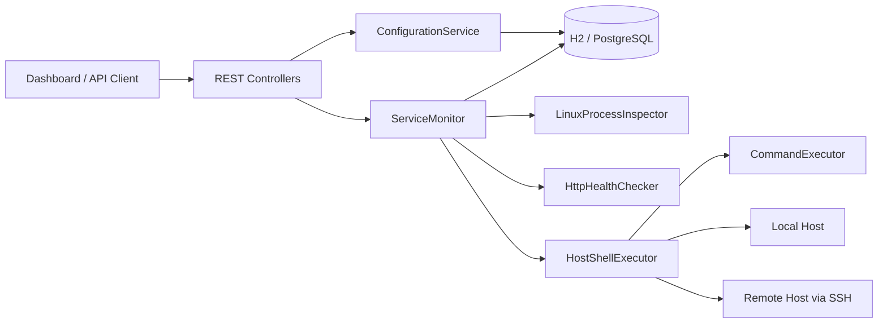
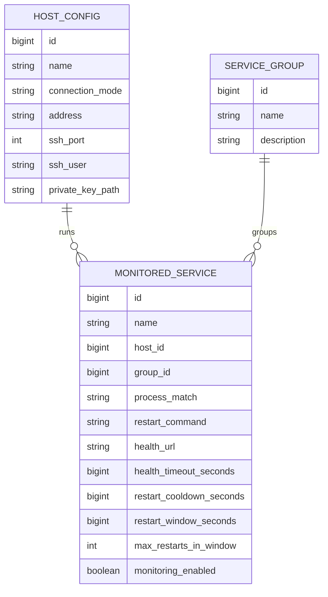

# Host Guardian


Host Guardian is a Spring Boot service for monitoring and restarting applications that may live on different Linux hosts.

The project combines:

- background process monitoring;
- optional HTTP health checks;
- automatic and manual restarts;
- host-aware execution through `LOCAL` or `SSH`;
- configuration stored in the database;
- built-in web dashboard for operations.

---

## What It Solves

Many internal services are still started outside of `systemd`, Kubernetes, or mature supervisors.  
They run as plain `java -jar ...`, shell scripts, or long-lived background processes on one or more Linux servers.

That creates a few practical problems:

- there is no central place to see whether the process is alive;
- health endpoints may fail even if the process still exists;
- restart commands are often manual and host-specific;
- teams need a way to temporarily pause monitoring during maintenance;
- operational configuration gets scattered across YAML files and shell history.

Host Guardian addresses that by moving service definitions into the database, attaching each service to a target host, and exposing a simple operational UI and REST API over the top.

---

## Current Feature Set

- Monitoring configuration stored in the database instead of static YAML service lists.
- Host registry with `LOCAL` and `SSH` connection modes.
- Optional service grouping for dashboard filtering.
- Flag-based pause/resume of monitoring through `monitoringEnabled`.
- Periodic monitoring via Spring scheduling.
- Linux process lookup through `pgrep -af`.
- Optional HTTP health checks.
- Automatic restart command execution with cooldown and restart-window protection.
- Manual `restart` and manual `check` actions through REST API and dashboard.
- Built-in dashboard for creating, editing, deleting, filtering, and operating monitored services.
- Flyway-managed schema migrations.
- H2 support for local start and PostgreSQL support through a dedicated profile.

---

## Tech Stack

| Area | Technology |
|---|---|
| Language | Java 17+ |
| Framework | Spring Boot 3.2.5 |
| Web | Spring Web MVC |
| Persistence | Spring Data JPA, Hibernate |
| Migrations | Flyway |
| Databases | H2, PostgreSQL |
| Monitoring execution | `bash`, `pgrep`, `curl`, `ssh` |
| UI | Built-in static dashboard (`HTML`, `CSS`, `JavaScript`) |

---

## Architecture

The project is organized as a modular Spring Boot backend with a built-in admin UI.
Configuration is persisted in relational tables, while runtime check status is kept in memory for fast dashboard access.



### Core Flow

1. Scheduler starts a monitoring cycle.
2. `ServiceMonitor` loads all services from the database.
3. For each enabled service it:
   checks process presence,
   optionally runs HTTP health check,
   evaluates restart policy,
   executes restart command locally or through SSH if needed.
4. The latest runtime state is exposed through the dashboard API.

---

## Domain Model

The current persistent model is intentionally compact and operations-focused.



### Persistent tables

- `host_config` stores target hosts and how to connect to them.
- `service_group` stores optional logical groups for filtering.
- `monitored_service` stores restart logic and health-check settings for each service.

### Runtime-only state

`ServiceState` is not stored in the database.
It keeps transient operational data such as:

- last known status;
- last check time;
- last restart time;
- restart history used for cooldown and restart window enforcement;
- last message shown in the dashboard.

---

## Project Structure

```text
src/main/java/com/example/guardian
+-- api          # request/response DTOs and mapping
+-- config       # application-level configuration properties
+-- controller   # REST endpoints
+-- model        # JPA entities and runtime status models
+-- repository   # Spring Data repositories
+-- scheduler    # background scheduling entrypoint
+-- service      # monitoring, host execution, configuration logic

src/main/resources
+-- db/migration # Flyway migrations
+-- static       # built-in dashboard UI
+-- application.yml
+-- application-postgres.yml
```

---

## Quick Start

## Local Start with H2

Default startup uses file-based H2 and is the fastest way to run the project locally.

```bash
mvn spring-boot:run
```

Default H2 settings:

- JDBC URL: `jdbc:h2:file:./data/host-guardian;MODE=PostgreSQL;AUTO_SERVER=TRUE`
- H2 console: [http://localhost:8099/h2-console](http://localhost:8099/h2-console)
- App URL: [http://localhost:8099](http://localhost:8099)

On first start the app creates a default local host entry automatically.

---

## Start with PostgreSQL

The project supports PostgreSQL through the `postgres` Spring profile.

### Option 1: Start local PostgreSQL via Docker Compose

```bash
docker compose -f docker-compose.postgres.yml up -d
```

Then start the app with:

```bash
mvn spring-boot:run -Dspring-boot.run.profiles=postgres
```

Or if you run a packaged jar:

```bash
java -jar app.jar --spring.profiles.active=postgres
```

### Option 2: Connect to an existing PostgreSQL instance

Set environment variables:

```bash
POSTGRES_URL=jdbc:postgresql://localhost:5432/host_guardian
POSTGRES_USER=host_guardian
POSTGRES_PASSWORD=host_guardian
```

And run with profile:

```bash
SPRING_PROFILES_ACTIVE=postgres
```

Detailed PostgreSQL notes are also available in [POSTGRES.md](D:\hi-lt-atm\hi-lt-watcher\POSTGRES.md).

---

## Configuration Profiles

### Default profile

Defined in [application.yml](D:\hi-lt-atm\hi-lt-watcher\src\main\resources\application.yml):

- H2 datasource;
- Flyway validation path through standard startup;
- H2 console enabled;
- monitor interval configured through `monitor.interval`.

### PostgreSQL profile

Defined in [application-postgres.yml](D:\hi-lt-atm\hi-lt-watcher\src\main\resources\application-postgres.yml):

- PostgreSQL datasource;
- H2 console disabled;
- externalized credentials via environment variables.

---

## Remote Hosts and SSH

Host Guardian can execute checks and restart commands in two modes:

- `LOCAL` — commands are executed directly on the machine where Host Guardian runs;
- `SSH` — commands are executed on a remote Linux host using the system `ssh` client.

### SSH assumptions in the current version

- Host Guardian is expected to run on Linux for production usage.
- `ssh`, `bash`, `pgrep`, and `curl` must be available in `PATH`.
- SSH uses key-based access.
- The host entry stores:
  host address,
  SSH port,
  SSH user,
  path to private key.
- For remote hosts, health checks are executed on the target host itself through `curl`.

That last point matters because many internal health endpoints are only available as `127.0.0.1` on the remote machine.

---

## Web Dashboard

The built-in dashboard lives at `/` and is backed entirely by the project itself.

### What the dashboard supports

- create, edit, and delete hosts;
- create, edit, and delete groups;
- create, edit, and delete monitored services;
- filter service view by one or more groups;
- manually trigger service check;
- manually trigger service restart;
- pause or resume monitoring per service;
- inspect latest status, process result, health result, and last message.

### Dashboard data shown per service

- service name;
- host and connection mode;
- group;
- monitoring enabled or paused state;
- calculated health status;
- process lookup result;
- health-check result;
- last check time;
- last restart time;
- latest operational message.

---

## REST API Overview

Base UI and API are served from the same application.

### Hosts

| Method | Path | Description |
|---|---|---|
| `GET` | `/api/hosts` | List configured hosts |
| `POST` | `/api/hosts` | Create host |
| `PUT` | `/api/hosts/{id}` | Update host |
| `DELETE` | `/api/hosts/{id}` | Delete host |

### Groups

| Method | Path | Description |
|---|---|---|
| `GET` | `/api/groups` | List groups |
| `POST` | `/api/groups` | Create group |
| `PUT` | `/api/groups/{id}` | Update group |
| `DELETE` | `/api/groups/{id}` | Delete group |

### Monitored services

| Method | Path | Description |
|---|---|---|
| `GET` | `/api/services` | List services |
| `GET` | `/api/services/{id}` | Get one service |
| `POST` | `/api/services` | Create service |
| `PUT` | `/api/services/{id}` | Update service |
| `DELETE` | `/api/services/{id}` | Delete service |
| `PATCH` | `/api/services/{id}/monitoring?enabled=true|false` | Pause/resume monitoring |
| `POST` | `/api/services/{id}/restart` | Trigger manual restart |
| `POST` | `/api/services/{id}/check` | Trigger immediate check |

### Dashboard

| Method | Path | Description |
|---|---|---|
| `GET` | `/api/dashboard` | Dashboard summary and service state |

Group filtering is supported through repeated query params:

```text
/api/dashboard?groupId=1&groupId=2
```

---

## Example Use Cases

### Example 1: Local app running as `java -jar`

- Host mode: `LOCAL`
- Process match: `billing-service.jar`
- Health URL: `http://127.0.0.1:8085/actuator/health`
- Restart command:

```bash
nohup java -jar /opt/apps/billing-service.jar >> /var/log/billing-service.log 2>&1 &
```

### Example 2: Remote app on another server

- Host mode: `SSH`
- Host address: `10.10.20.15`
- Process match: `order-worker.jar`
- Health URL: `http://127.0.0.1:8092/actuator/health`
- Restart command:

```bash
cd /opt/order-worker && nohup java -jar order-worker.jar >> /var/log/order-worker.log 2>&1 &
```

---

## Why Restart Protection Matters

Blind restart loops can make incidents worse.

Host Guardian protects against that using:

- `restartCooldownSeconds` — minimum time between restarts;
- `restartWindowSeconds` — time window for counting restart attempts;
- `maxRestartsInWindow` — maximum restart count allowed inside that window.

This prevents simple restart storms when a service has a persistent startup failure.

---

## Database Migrations

Schema is managed through Flyway.

Current migration:

- [V1__init.sql](D:\hi-lt-atm\hi-lt-watcher\src\main\resources\db\migration\V1__init.sql)

Flyway runs automatically on startup for both H2 and PostgreSQL.

---

## Operational Notes

- The service is designed for Linux-oriented operational environments.
- Shell commands should be self-contained and safe to run non-interactively.
- If a monitored app requires environment variables, working directory changes, or stdout redirection, include that in the restart command.
- For SSH hosts, filesystem paths and local loopback health URLs are interpreted on the remote machine, not on the Host Guardian host.

---

## Current Limitations

- SSH secrets are not encrypted in the database.
- Runtime status is in memory and is not persisted across restarts.
- There is no full audit trail for configuration changes yet.
- There is no notification channel yet.
- There is no role-based access control for the dashboard or API yet.
- SSH auth currently assumes private key usage rather than password auth.
- The frontend is an embedded operational dashboard, not a separate SPA.

---

## Roadmap Ideas

- encrypt SSH-related secrets or move them into a secret manager;
- persist check history and restart history in dedicated tables;
- add alerts for Telegram, Slack, and email;
- add optimistic locking and audit metadata for configuration changes;
- add authentication and authorization for operators;
- support richer host execution strategies;
- add service templates for recurring patterns;
- add maintenance windows and scheduled pause rules.

---

## Status

This project already works as a practical operations console for host-based service monitoring, but it is still at the stage where the platform shape is emerging.

It is especially useful when:

- you have several internal services on one or more Linux hosts;
- not everything is under Kubernetes or `systemd`;
- you want a central place to observe state and trigger recovery actions;
- you need something lighter than a full infrastructure monitoring stack.

If you want, the next good README upgrade after this would be adding:

- screenshots or GIFs of the dashboard;
- sample JSON payloads for the REST API;
- a ready-to-run demo dataset;
- a small sequence diagram for `LOCAL` vs `SSH` execution.
