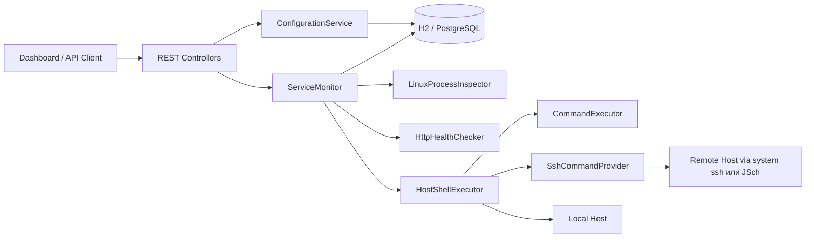
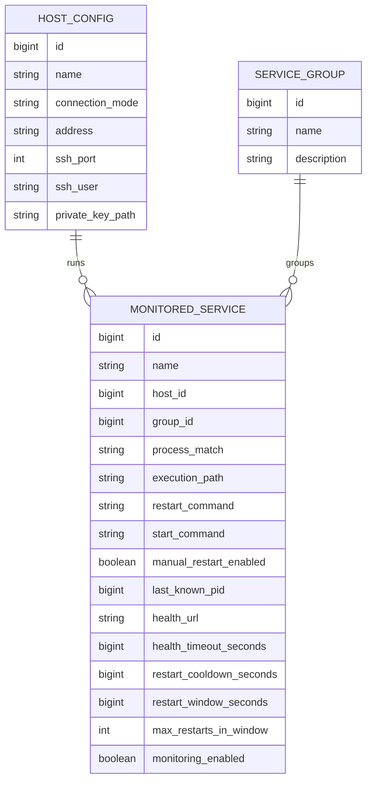

# Host Guardian


Host Guardian - это Spring Boot приложение для мониторинга и перезапуска сервисов, которые могут работать на разных Linux-хостах.

Проект объединяет:

- фоновый мониторинг процессов;
- опциональные HTTP health-check проверки;
- автоматический start recovery и проверенные ручные перезапуски;
- выполнение команд с учетом хоста через режимы `LOCAL` или `SSH` с переключаемыми SSH-провайдерами;
- хранение конфигурации в базе данных;
- встроенную веб-панель для операционных задач.

---

## Какую проблему решает

Многие внутренние сервисы все еще запускаются вне `systemd`, Kubernetes или зрелых supervisor-решений.  
Они работают как обычные `java -jar ...`, shell-скрипты или долгоживущие фоновые процессы на одном или нескольких Linux-серверах.

Из-за этого появляются практические проблемы:

- нет единого места, где видно, жив ли процесс;
- health endpoint может падать даже тогда, когда сам процесс еще существует;
- команды перезапуска часто выполняются вручную и зависят от конкретного хоста;
- во время обслуживания нужно временно отключать мониторинг;
- операционная конфигурация расползается по YAML-файлам и истории shell-команд.

Host Guardian решает это так: определения сервисов хранятся в базе данных, каждый сервис привязывается к целевому хосту, а поверх этого предоставляются простая веб-панель и REST API.

---

## Текущие возможности

- Хранение конфигурации мониторинга в базе данных вместо статических YAML-списков сервисов.
- Реестр хостов с режимами подключения `LOCAL` и `SSH`.
- Опциональная группировка сервисов для фильтрации на dashboard.
- Приостановка и возобновление мониторинга через флаг `monitoringEnabled`.
- Периодический мониторинг через Spring scheduling.
- Поиск Linux-процессов через `pgrep -af`, сохранение PID и дополнительная проверка по PID.
- Опциональные HTTP health-check проверки.
- Опциональный путь выполнения сервиса перед командами старта и ручного рестарта.
- Обязательная команда старта для каждого сервиса.
- Start-only recovery для отсутствующих сервисов и проверенный ручной restart-flow для упавших health-check.
- Защита по cooldown и окну перезапусков.
- Ручные действия `restart` и `check` через REST API и dashboard.
- Встроенный dashboard для создания, редактирования, удаления, фильтрации и управления сервисами.
- Переключаемый SSH provider: системный `ssh` client или JSch.
- Миграции схемы через Flyway.
- Поддержка H2 для локального запуска и PostgreSQL через отдельный профиль.

---

## Технологический стек

| Область | Технология |
|---|---|
| Язык | Java 17+ |
| Framework | Spring Boot 3.2.5 |
| Web | Spring Web MVC |
| Persistence | Spring Data JPA, Hibernate |
| Миграции | Flyway |
| Базы данных | H2, PostgreSQL |
| Выполнение мониторинга | `bash`, `pgrep`, `curl`, системный `ssh`, JSch |
| UI | Встроенный статический dashboard (`HTML`, `CSS`, `JavaScript`) |

---

## Архитектура

Проект организован как модульный Spring Boot backend со встроенной административной панелью.
Конфигурация хранится в реляционных таблицах, а runtime-статус проверок держится в памяти для быстрого доступа из dashboard.



### Основной поток

1. Scheduler запускает цикл мониторинга.
2. `ServiceMonitor` загружает все сервисы из базы данных.
3. Для каждого включенного сервиса выполняется поиск процесса, сохранение последнего PID, проверка живости PID, при необходимости HTTP health-check, оценка recovery policy, запуск только команды старта для отсутствующего сервиса и фиксация failed health-check до явного действия оператора.
4. Последнее runtime-состояние отдается через dashboard API.

---

## Доменная модель

Текущая persistent-модель намеренно компактная и ориентирована на операционное использование.



### Persistent-таблицы

- `host_config` хранит целевые хосты и способ подключения к ним.
- `service_group` хранит опциональные логические группы для фильтрации.
- `monitored_service` хранит поиск процесса, настройки выполнения команд, логику перезапуска, последний известный PID и настройки health-check для каждого сервиса.

Колонки команд используют `varchar(4096)` для совместимости с PostgreSQL.

### Runtime-состояние

`ServiceState` не хранится в базе данных.
Он содержит временные операционные данные:

- последний известный статус;
- время последней проверки;
- время последнего перезапуска;
- результат последней проверки процесса и health-check;
- историю перезапусков для cooldown и restart window;
- последнее сообщение, показываемое в dashboard.

---

## Структура проекта

```text
src/main/java/com/example/guardian
+-- api          # DTO запросов/ответов и маппинг
+-- config       # конфигурационные properties приложения
+-- controller   # REST endpoints
+-- model        # JPA entities и runtime-модели статуса
+-- repository   # Spring Data repositories
+-- scheduler    # точка входа фонового scheduler
+-- service      # мониторинг, выполнение на хостах, конфигурационная логика

src/main/resources
+-- db/migration # Flyway migrations
+-- static       # встроенный dashboard UI
+-- application.yml
+-- application-postgres.yml
```

---

## Быстрый старт

## Локальный запуск с H2

По умолчанию приложение использует file-based H2. Это самый быстрый способ запустить проект локально.

```bash
mvn spring-boot:run
```

Настройки H2 по умолчанию:

- JDBC URL: `jdbc:h2:file:./data/host-guardian;MODE=PostgreSQL;AUTO_SERVER=TRUE`
- H2 console: [http://localhost:8099/h2-console](http://localhost:8099/h2-console)
- App URL: [http://localhost:8099](http://localhost:8099)

При первом запуске приложение автоматически создает запись локального хоста.

---

## Запуск с PostgreSQL

PostgreSQL поддерживается через Spring profile `postgres`.

### Вариант 1: запустить локальный PostgreSQL через Docker Compose

```bash
docker compose -f docker-compose.postgres.yml up -d
```

Затем запустить приложение:

```bash
mvn spring-boot:run -Dspring-boot.run.profiles=postgres
```

Или, если используется собранный jar:

```bash
java -jar app.jar --spring.profiles.active=postgres
```

### Вариант 2: подключиться к существующему PostgreSQL

Задайте переменные окружения:

```bash
POSTGRES_URL=jdbc:postgresql://localhost:5432/host_guardian
POSTGRES_USER=host_guardian
POSTGRES_PASSWORD=host_guardian
```

И запустите приложение с профилем:

```bash
SPRING_PROFILES_ACTIVE=postgres
```

Подробные заметки по PostgreSQL доступны в [POSTGRES.md](POSTGRES.md).

---

## Конфигурационные профили

### Default profile

Определен в [application.yml](src/main/resources/application.yml):

- H2 datasource;
- стандартная startup-валидация Flyway;
- включенная H2 console;
- интервал мониторинга через `monitor.interval`;
- SSH provider через `monitor.ssh.provider`;
- timeouts команд через `monitor.command.*`.

Основные настройки по умолчанию:

```yaml
monitor:
  interval: 30s
  ssh:
    provider: system # system | jsch
    strict-host-key-checking: false
  command:
    process-lookup-timeout: 5s
    pid-check-timeout: 3s
    stop-timeout: 10s
    stop-command-extra-timeout: 2s
    restart-timeout: 20s
    start-timeout: 20s
    health-command-extra-timeout: 1s
    ssh-connect-timeout: 5s
```

### PostgreSQL profile

Определен в [application-postgres.yml](src/main/resources/application-postgres.yml):

- PostgreSQL datasource;
- отключенная H2 console;
- credentials через переменные окружения.

---

## Удаленные хосты и SSH

Host Guardian может выполнять проверки и restart-команды в двух режимах:

- `LOCAL` - команды выполняются прямо на машине, где запущен Host Guardian;
- `SSH` - команды выполняются на удаленном Linux-хосте через настроенный SSH provider.

### SSH providers

- `system` использует системный `ssh` client и сохраняет исходное поведение.
- `jsch` использует Java-библиотеку JSch и не требует установленного `ssh` executable на машине Host Guardian.

Выбор provider:

```yaml
monitor:
  ssh:
    provider: jsch
```

### Текущие предположения для SSH

- Целевые хосты ожидаются Linux-хостами.
- `bash`, `pgrep` и `curl` должны быть доступны на целевых хостах.
- Provider `system` дополнительно требует `ssh` в `PATH` на машине Host Guardian.
- SSH использует key-based доступ.
- Запись хоста хранит адрес, SSH port, SSH user и путь к private key.
- Для удаленных хостов health-check выполняется на самом целевом хосте через `curl`.
- `strict-host-key-checking` сейчас применяется provider-ом JSch. Provider `system` использует настройки SSH client на машине Host Guardian.

Поведение remote health-check важно: многие внутренние health endpoints доступны только как `127.0.0.1` на удаленной машине.

---

## Web Dashboard

Встроенный dashboard доступен по `/` и полностью обслуживается самим приложением.

### Dashboard поддерживает

- создание, редактирование и удаление хостов;
- создание, редактирование и удаление групп;
- создание, редактирование и удаление мониторируемых сервисов;
- фильтрацию списка сервисов по одной или нескольким группам;
- ручной запуск проверки сервиса;
- ручной запуск перезапуска сервиса;
- постановку мониторинга на паузу и возобновление мониторинга по каждому сервису;
- просмотр последнего статуса, результата проверки процесса, PID, состояния Health check и последнего сообщения;
- busy-анимацию при сохранении и выполнении операций с сервисами.

### Данные, отображаемые по сервису

- имя сервиса;
- хост и режим подключения;
- группа;
- включен мониторинг или стоит пауза;
- вычисленный health status;
- результат поиска процесса;
- последний известный PID;
- отдельное состояние Health check: `yes`, `no` или `off`, если URL не задан;
- время последней проверки;
- время последнего перезапуска;
- последнее операционное сообщение.

---

## OpenAPI и Swagger UI

Приложение публикует OpenAPI-спецификацию и Swagger UI:

- Swagger UI: [http://localhost:8099/swagger-ui.html](http://localhost:8099/swagger-ui.html)
- OpenAPI JSON: [http://localhost:8099/v3/api-docs](http://localhost:8099/v3/api-docs)

Описание API настроено в [OpenApiConfig.java](src/main/java/com/example/guardian/config/OpenApiConfig.java), а endpoints дополнительно документированы OpenAPI-аннотациями в контроллерах.

---

## REST API

UI и API обслуживаются одним приложением.

### Hosts

| Method | Path | Описание |
|---|---|---|
| `GET` | `/api/hosts` | Получить список настроенных хостов |
| `POST` | `/api/hosts` | Создать хост |
| `PUT` | `/api/hosts/{id}` | Обновить хост |
| `DELETE` | `/api/hosts/{id}` | Удалить хост |

### Groups

| Method | Path | Описание |
|---|---|---|
| `GET` | `/api/groups` | Получить список групп |
| `POST` | `/api/groups` | Создать группу |
| `PUT` | `/api/groups/{id}` | Обновить группу |
| `DELETE` | `/api/groups/{id}` | Удалить группу |

### Monitored services

| Method | Path | Описание |
|---|---|---|
| `GET` | `/api/services` | Получить список сервисов |
| `GET` | `/api/services/{id}` | Получить один сервис |
| `POST` | `/api/services` | Создать сервис |
| `PUT` | `/api/services/{id}` | Обновить сервис |
| `DELETE` | `/api/services/{id}` | Удалить сервис |
| `PATCH` | `/api/services/{id}/monitoring?enabled=true|false` | Поставить мониторинг на паузу или возобновить |
| `POST` | `/api/services/{id}/restart` | Запустить проверенное restart/start recovery |
| `POST` | `/api/services/{id}/check` | Запустить немедленную проверку |

### Dashboard

| Method | Path | Описание |
|---|---|---|
| `GET` | `/api/dashboard` | Получить summary dashboard и runtime-состояния сервисов |

Фильтрация по группам поддерживается через повторяющиеся query params:

```text
/api/dashboard?groupId=1&groupId=2
```

---

## Примеры использования

### Пример 1: локальное приложение как `java -jar`

- Host mode: `LOCAL`
- Process match: `billing-service.jar`
- Execution path: `/opt/apps/billing-service`
- Start command:

```bash
nohup java -jar billing-service.jar >> /var/log/billing-service.log 2>&1 &
```

- Ручная команда рестарта: отключена. Если сервис отсутствует, Host Guardian выполняет только start command. Если оператор нажимает restart и настроенный health-check падает, Host Guardian находит и останавливает процесс, после timeout выполняет `kill -9`, затем запускает start command.
- Health URL: `http://127.0.0.1:8085/actuator/health`

### Пример 2: удаленное приложение на другом сервере

- Host mode: `SSH`
- Host address: `10.10.20.15`
- Process match: `order-worker.jar`
- Execution path: `/opt/order-worker`
- Start command:

```bash
nohup java -jar order-worker.jar >> /var/log/order-worker.log 2>&1 &
```

- Ручная команда рестарта: включена
- Restart command:

```bash
./stop.sh
```

- Health URL: `http://127.0.0.1:8092/actuator/health`

---

## Зачем нужна защита от частых перезапусков

Слепые restart loops могут ухудшить инцидент.

Host Guardian защищается от этого с помощью:

- `restartCooldownSeconds` - минимальное время между перезапусками;
- `restartWindowSeconds` - окно времени для подсчета попыток перезапуска;
- `maxRestartsInWindow` - максимальное число перезапусков внутри окна.

Это предотвращает restart storm, если сервис стабильно не может стартовать.

---

## Миграции базы данных

Схема управляется через Flyway.

Текущие миграции:

- [V1__init.sql](src/main/resources/db/migration/V1__init.sql)
- [V2__service_start_and_pid.sql](src/main/resources/db/migration/V2__service_start_and_pid.sql)

Flyway автоматически запускается при старте приложения для H2 и PostgreSQL.

---

## Тесты и покрытие

Проект содержит unit tests для моделей, API mapper, REST controllers, конфигурационного сервиса, мониторинга, shell/command/http-сервисов, bootstrap и scheduler.

Запуск тестов и проверки покрытия:

```bash
mvn verify
```

В `pom.xml` настроен JaCoCo gate: line coverage и instruction coverage должны быть не ниже `80%`.

---

## Операционные заметки

- Сервис ориентирован на Linux-операционные окружения.
- Shell-команды должны быть самодостаточными и безопасными для non-interactive запуска.
- Если мониторируемому приложению нужны environment variables или stdout redirection, включайте это в start command или ручную restart command.
- Если у сервиса задан execution path, Host Guardian выполняет start и ручную restart command как `cd '<executionPath>' && <command>`.
- Для SSH-хостов filesystem paths и local loopback health URLs интерпретируются на удаленной машине, а не на хосте Host Guardian.

---

## Текущие ограничения

- SSH secrets не шифруются в базе данных.
- Runtime status хранится в памяти и не переживает restart приложения.
- Пока нет полноценного audit trail для изменений конфигурации.
- Пока нет notification channel.
- Пока нет role-based access control для dashboard и API.
- SSH auth сейчас предполагает private key, а не password auth.
- Provider JSch использует настроенный private key path; отдельное управление passphrase пока не моделируется.
- Frontend - это встроенный операционный dashboard, а не отдельное SPA.

---

## Идеи для roadmap

- шифровать SSH-related secrets или вынести их в secret manager;
- сохранять check history и restart history в отдельных таблицах;
- добавить alerts в Telegram, Slack и email;
- добавить optimistic locking и audit metadata для изменений конфигурации;
- добавить authentication и authorization для операторов;
- поддержать более богатые стратегии выполнения команд на хостах;
- добавить service templates для повторяющихся сценариев;
- добавить maintenance windows и scheduled pause rules.

---

## Статус

Проект уже работает как практичная операционная консоль для host-based service monitoring, но все еще находится на этапе активного формирования платформы.

Он особенно полезен, когда:

- у вас есть несколько внутренних сервисов на одном или нескольких Linux-хостах;
- не все запущено под Kubernetes или `systemd`;
- нужно центральное место для наблюдения состояния и запуска recovery-действий;
- нужен инструмент легче, чем полноценный infrastructure monitoring stack.

